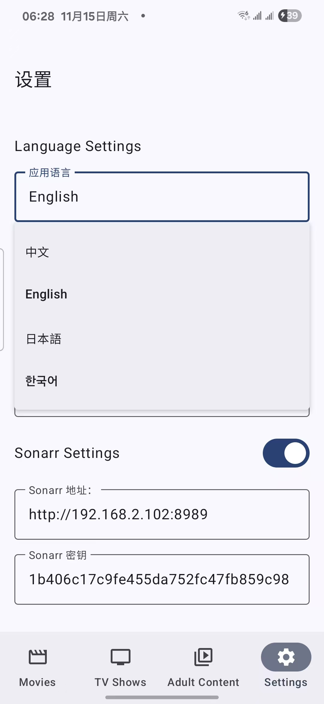
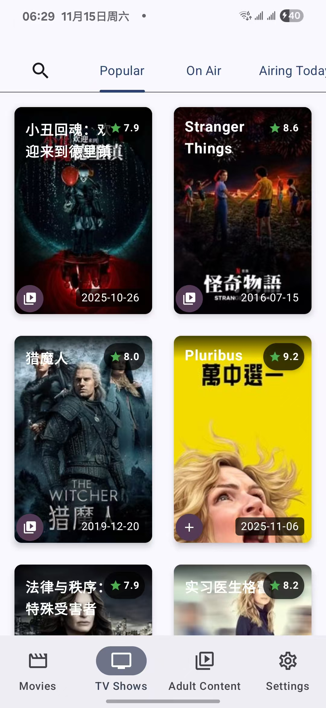
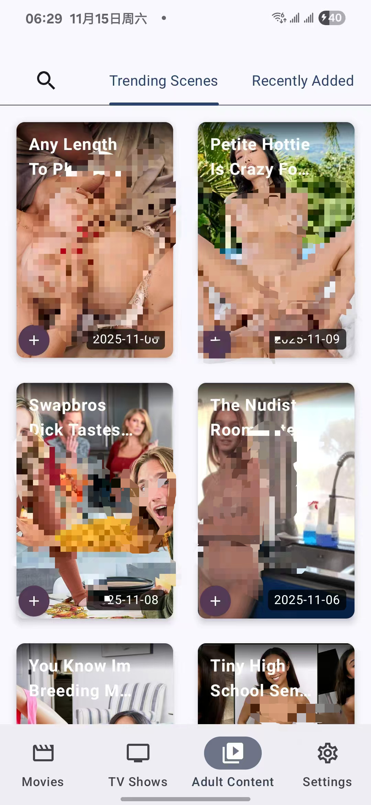

# 🎬 Yesseerr

> 🚀 强大的 Servarr 生态系统移动端管理工具  
> 🆓 **完全免费 · 无广告**

专为自托管媒体服务器打造的 Android 应用，完美支持 **Radarr**、**Sonarr** 和 **Whisparr**。

[📥 立即下载](https://github.com/niunaiyi/yesseerr/releases/latest) | [🐛 报告问题](https://github.com/niunaiyi/yesseerr/issues) | [💝 支持开发](https://github.com/sponsors/niunaiyi)

---

## 💝 支持 Yesseerr

Yesseerr 是**完全免费**的项目！如果觉得有帮助，可以：

- ⭐ **[给项目一个 Star](https://github.com/niunaiyi/yesseerr)** - 最简单的支持方式
- 💰 **[成为赞助者](https://github.com/sponsors/niunaiyi)** - 支持持续开发
- 🐛 **[报告 Bug](https://github.com/niunaiyi/yesseerr/issues)** - 帮助改进项目
### 赞助档位

| 档位 | 金额 | 权益 |
|------|------|------|
| ☕ 咖啡支持者 | $3/月 | 感谢名单 + 专属徽章 |
| 🌟 银牌赞助者 | $10/月 | 优先技术支持 + 提前通知 |
| 💎 金牌赞助者 | $25/月 | 功能建议优先 + 未来Pro版免费 |

[查看所有档位详情 →](https://github.com/sponsors/niunaiyi)

**未来计划**：我们计划在 6-12 个月后推出 Pro 版本（付费高级功能）。  
**早期支持者福利**：所有现在的赞助者将**永久免费**获得 Pro 版本！🎁

---

## ✨ 主要功能

### 🎬 电影管理
- 与 **Radarr** 无缝集成
- 多种分类浏览（流行、热门、最高评分等）
- 实时搜索和添加电影
- 详细信息展示（演员、评分、简介）

### 📺 电视剧管理
- 完整的 **Sonarr** 支持
- 剧集和季度信息
- 追踪正在播出的节目
- 智能搜索功能

### 🔞 成人内容管理
- 集成 **Whisparr** 和 **StashDB**
- 分类浏览和搜索
- 演员和标签信息
- ⚠️ **18+ 内容，需年满 18 周岁**

### 🎨 现代化设计
- Material Design 3 界面
- 深色/浅色主题自适应
- 流畅动画和过渡效果
- 响应式布局

### 🌐 多语言支持
中文 | English | 日本語 | 한국어 | Español | Français | Deutsch | Русский

---

## 📱 应用截图

  
  
  
  

---

## 🚀 快速开始

### 配置 Radarr（可选）

1. 打开您的 Radarr Web 界面
2. 前往 **设置 → 通用 → 安全**
3. 复制 **API 密钥**
4. 在应用中填入：
   - 服务器地址：`http://your-server:7878`
   - API 密钥：刚才复制的密钥

### 配置 Sonarr（可选）

1. 打开 Sonarr Web 界面
2. 前往 **设置 → 通用 → 安全**
3. 复制 **API 密钥**
4. 在应用中填入：
   - 服务器地址：`http://your-server:8989`
   - API 密钥：刚才复制的密钥

### 配置 Whisparr（可选）

1. 打开 Whisparr Web 界面
2. 前往 **设置 → 通用 → 安全**
3. 复制 **API 密钥**
4. 在应用中填入：
   - 服务器地址：`http://your-server:6969`
   - API 密钥：刚才复制的密钥

---

## 📝 待办事项

- [ ] 支持批量添加电影/电视剧
- [ ] 添加下载进度追踪
- [ ] 支持自定义主题颜色
- [ ] 添加通知功能
- [ ] 支持 Jellyfin/Plex 集成
- [ ] 添加小部件支持

---

## 🐛 已知问题

- 在某些 Android 8.0 设备上可能出现图片加载延迟
- StashDB 搜索在某些区域可能较慢

查看完整的问题列表：[GitHub Issues](https://github.com/niunaiyi/yesseerr/issues)

---

## ❓ 常见问题

### Q: 应用需要哪些权限？
A: 仅需要网络访问权限，不需要其他敏感权限。

### Q: 数据是否会被上传到云端？
A: 否，所有配置都存储在本地，应用直连您的服务器。

### Q: 支持哪些 Android 版本？
A: Android 8.0 (Oreo) 及以上版本。

### Q: 应用是否开源？
A: 本应用为专有软件，源代码不公开。详见 [LICENSE](LICENSE) 文件。

### Q: 如何报告 Bug？
A: 请在 [GitHub Issues](https://github.com/niunaiyi/yesseerr/issues) 提交问题。

---

## 📄 许可证

© 2025 Yesseerr. All rights reserved.

本软件为专有软件，未经授权不得复制或修改。详见 [LICENSE](LICENSE) 文件。

---

## 🙏 致谢

### 集成的服务

- [TMDB](https://www.themoviedb.org/) - 电影和电视剧数据库
- [StashDB](https://stashdb.org/) - 成人场景数据库
- [Radarr](https://radarr.video/) - 电影管理系统
- [Sonarr](https://sonarr.tv/) - 电视剧管理系统
- [Whisparr](https://whisparr.com/) - 成人内容管理系统

---

## 📞 联系方式

- **GitHub**: [@niunaiyi](https://github.com/niunaiyi)
- **Email**: 请替换为你的邮箱
- **Issues**: [GitHub Issues](https://github.com/niunaiyi/yesseerr/issues)

---

## ⭐ Star 支持

如果这个项目对您有帮助，请给个 Star ⭐

**[⬆ 回到顶部](#-yesseerr)**

---

  使用 ❤️ 和 Kotlin 构建

